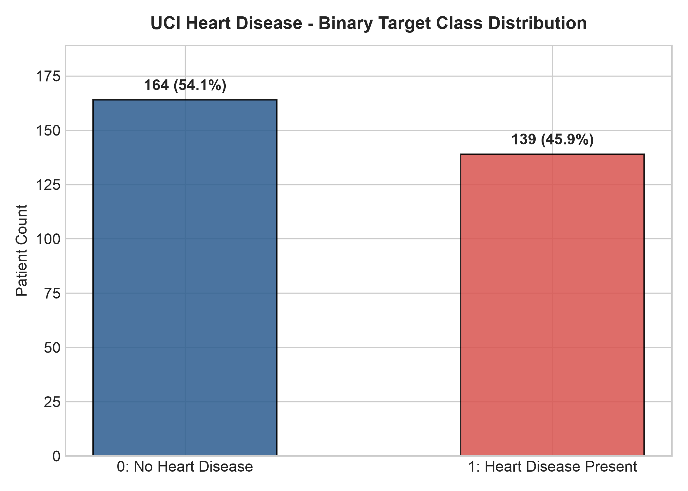
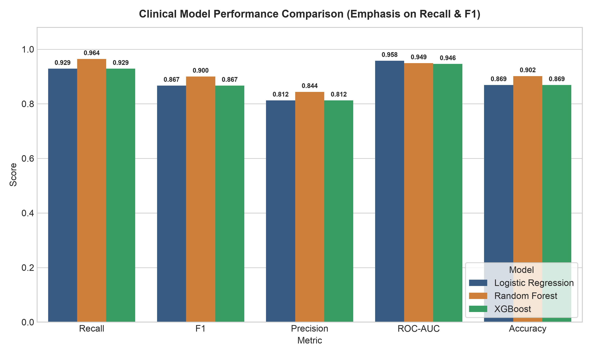
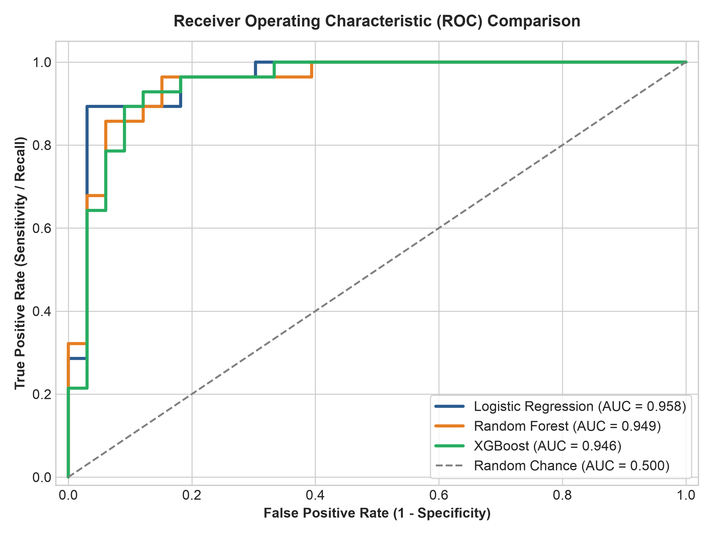
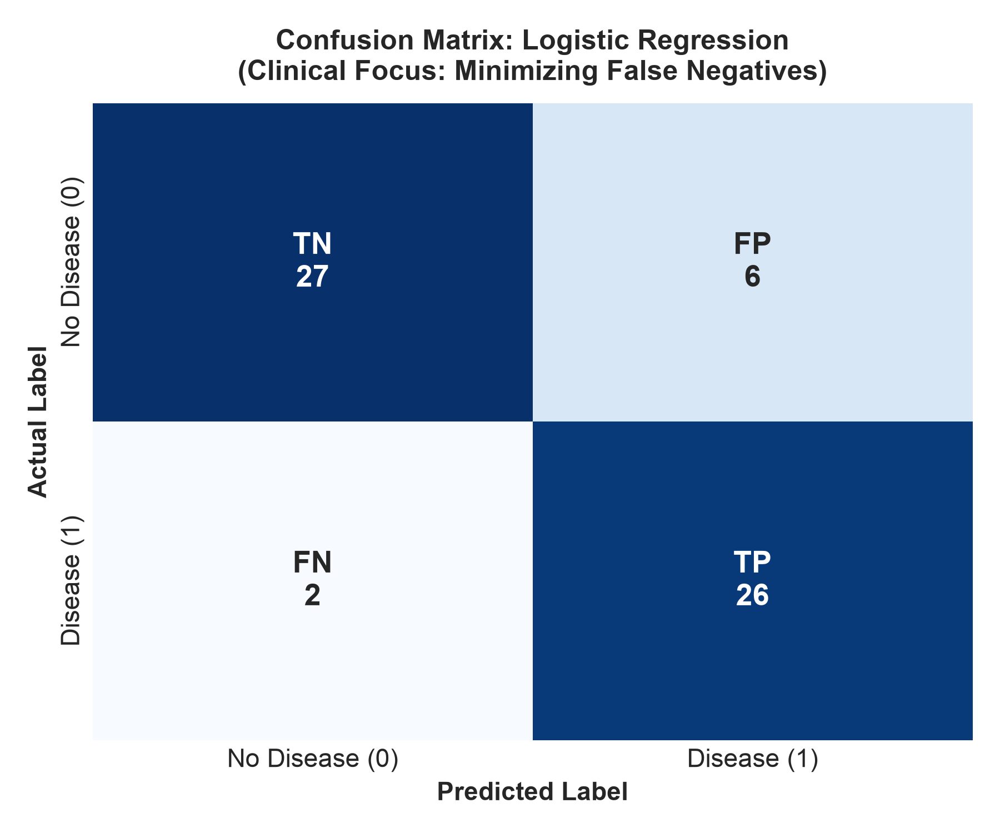
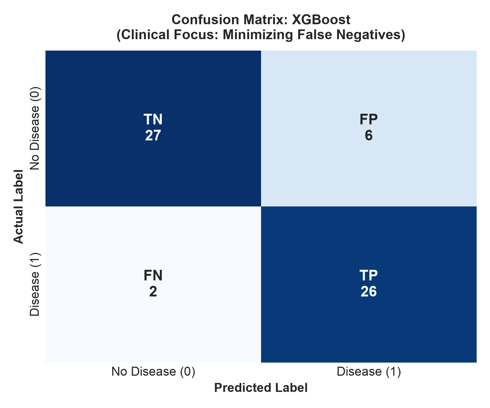
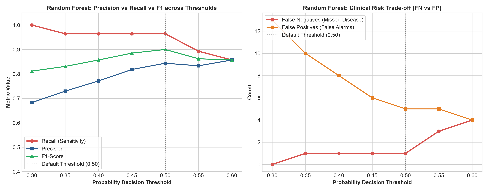

# Heart Disease Risk Prediction & Clinical Model Comparison

[](https://www.python.org/)
[](https://scikit-learn.org/)
[](https://xgboost.readthedocs.io/)
[](https://streamlit.io/)
[](LICENSE)

> **⚠️ Mandatory Medical & Educational Disclaimer:**
> This repository and its accompanying Streamlit application are for **educational and research demonstration purposes only**. This software is **NOT a medical diagnostic system**. Predictions generated by these models represent statistical approximations on benchmark research data and must never be used to make healthcare diagnoses, treatment choices, or triage decisions.

---

## 📋 Table of Contents
- [Overview](#overview)
- [Problem Statement](#problem-statement)
- [Dataset](#dataset)
- [Features](#features)
- [Data Preprocessing & Leakage Prevention](#data-preprocessing--leakage-prevention)
- [Models](#models)
- [Evaluation & Clinical Focus on Recall](#evaluation--why-recall-matters)
- [Experimental Results](#results)
- [Threshold Analysis & Sensitivity Calibration](#threshold-analysis)
- [Model Selection Rationale](#model-selection)
- [Streamlit Web Application](#streamlit-application)
- [Installation & Setup](#installation)
- [Model Training](#training)
- [Running the App](#running-the-app)
- [Test Suite](#test-suite)
- [Known Limitations](#known-limitations)
- [Future Improvements](#future-improvements)
- [Dataset Citation](#dataset-citation)

---

## Overview

In clinical risk modeling, machine learning algorithms frequently encounter an asymmetric loss surface: failing to identify an at-risk individual (**False Negative**) carries severe consequences, whereas misclassifying a healthy individual for confirmatory follow-up (**False Positive**) causes minor inconvenience.

This project delivers an end-to-end, production-grade machine learning system comparing classical linear models against ensemble architectures on the canonical **UCI Cleveland Heart Disease dataset**. It implements leak-free scikit-learn pipelines, rigorous clinical metric evaluations (Recall, Precision, F1, ROC-AUC, False Negative counts), probability decision-threshold calibration, and an interactive Streamlit risk visualization interface.

---

## Problem Statement

Given $13$ physiological and diagnostic attributes collected from clinical exams and treadmill stress tests, predict whether a patient presents with coronary heart disease ($\text{target} \in \{0, 1\}$).

The core objectives are:
1. Prevent data leakage by strictly fitting imputers and scalers on training folds.
2. Train, benchmark, and contrast **Logistic Regression**, **Random Forest**, and **XGBoost**.
3. Emphasize **Recall (Sensitivity)** and **False Negative reduction** rather than optimizing purely for raw classification accuracy.
4. Calibrate decision thresholds ($T \in [0.10, 0.90]$) to illustrate clinical screening trade-offs.
5. Deploy a self-contained web application enabling real-time risk scoring and threshold tuning.

---

## Dataset

The model utilizes the **Cleveland database** from the **UCI Machine Learning Repository** (Dataset ID 45).

- **Source:** [UCI Heart Disease Dataset](https://archive.ics.uci.edu/dataset/45/heart+disease)
- **Cohort Size:** 303 patient records
- **Raw Target (`num`):** Ranges from `0` (absence: diameter narrowing $<50\%$) to `1`, `2`, `3`, `4` (presence of coronary stenosis across multiple vessels).
- **Binary Conversion:**
  $$\text{target} = \begin{cases} 0 & \text{if } num = 0 \text{ (No Heart Disease: 164 cases, 54.1\%)} \\ 1 & \text{if } num \in \{1, 2, 3, 4\} \text{ (Heart Disease Present: 139 cases, 45.9\%)} \end{cases}$$



---

## Features

The 13 clinical attributes include 6 numerical features and 7 categorical features:

| Feature Name | Type | Description | Permitted / Observed Range |
| :--- | :--- | :--- | :--- |
| **`age`** | Numerical | Age in years | 29 – 77 |
| **`sex`** | Categorical | Biological sex | `0` = Female, `1` = Male |
| **`cp`** | Categorical | Chest pain type | `1` = Typical angina, `2` = Atypical angina, `3` = Non-anginal pain, `4` = Asymptomatic |
| **`trestbps`** | Numerical | Resting systolic blood pressure on admission | 94 – 200 mm Hg |
| **`chol`** | Numerical | Serum cholesterol | 126 – 564 mg/dl |
| **`fbs`** | Categorical | Fasting blood sugar $> 120$ mg/dl | `0` = False ($\le 120$), `1` = True ($> 120$) |
| **`restecg`** | Categorical | Resting electrocardiographic findings | `0` = Normal, `1` = ST-T abnormality, `2` = LV hypertrophy |
| **`thalach`** | Numerical | Maximum heart rate achieved during exercise | 71 – 202 bpm |
| **`exang`** | Categorical | Exercise-induced angina | `0` = No, `1` = Yes |
| **`oldpeak`** | Numerical | ST depression induced by exercise relative to rest | 0.0 – 6.2 mm |
| **`slope`** | Categorical | Slope of peak exercise ST segment | `1` = Upsloping, `2` = Flat, `3` = Downsloping |
| **`ca`** | Numerical | Number of major vessels colored by fluoroscopy | 0, 1, 2, 3 (4 missing values) |
| **`thal`** | Categorical | Thallium scintigraphy nuclear stress test | `3.0` = Normal, `6.0` = Fixed defect, `7.0` = Reversible defect (2 missing values) |

---

## Data Preprocessing & Leakage Prevention

To ensure strict reproducibility and eliminate information leakage:
1. **Stratified Splitting:** The data is split into 80% training ($N=242$) and 20% test ($N=61$) sets using `stratify=y` with a fixed seed (`random_state=42`).
2. **Numerical Pipeline:**
   - `SimpleImputer(strategy='median')`: Imputes missing values based solely on training median.
   - `StandardScaler()`: Standardizes features to zero mean and unit variance ($\mu=0, \sigma=1$).
3. **Categorical Pipeline:**
   - `SimpleImputer(strategy='most_frequent')`: Imputes missing category levels.
   - `OneHotEncoder(handle_unknown='ignore', sparse_output=False)`: Encodes discrete nominal levels while safely handling unseen categories at inference time.
4. **ColumnTransformer & Unified Pipeline:**
   The transformations and classifier are encapsulated into a single scikit-learn `Pipeline`:
   ```
   Pipeline([
       ('preprocessor', ColumnTransformer(...)),
       ('classifier', RandomForestClassifier(...))
   ])
   ```

---

## Models

Three diverse model families were trained:

1. **Logistic Regression (Linear Baseline):**
   - L2-regularized logistic regression (`max_iter=1000`, `C=1.0`). Provides interpretable baseline odds ratios.
2. **Random Forest Classifier (Ensemble Bagging):**
   - 300 decision trees (`n_estimators=300`, `max_depth=5`, `class_weight='balanced'`). Controls variance and handles non-linear interactions without feature leakage.
3. **XGBoost Classifier (Gradient Boosting):**
   - 300 gradient-boosted boosting rounds (`n_estimators=300`, `max_depth=3`, `learning_rate=0.05`, `subsample=0.8`, `colsample_bytree=0.8`, `eval_metric='logloss'`).

---

## Evaluation & Why Recall Matters

In medical screening:
- **True Positive (TP):** Patient has heart disease; model correctly flags high risk.
- **True Negative (TN):** Patient is healthy; model correctly flags low risk.
- **False Positive (FP):** Healthy patient flagged as high risk (leads to benign secondary confirmation / ECG).
- **False Negative (FN):** Patient with active heart disease classified as healthy (missed diagnosis, untreated condition).

$$\text{Recall (Sensitivity)} = \frac{\text{TP}}{\text{TP} + \text{FN}}, \quad \text{Precision (PPV)} = \frac{\text{TP}}{\text{TP} + \text{FP}}, \quad \text{F1} = 2 \times \frac{\text{Precision} \times \text{Recall}}{\text{Precision} + \text{Recall}}$$

A model cannot be judged on accuracy alone. Minimizing **False Negatives** is the primary clinical objective.

---

## Results

Below are the actual evaluation metrics obtained from evaluating the trained pipelines on the unseen test set ($N=61$):

### Model Comparison Table ($T=0.50$)

| Model | Accuracy | Precision | Recall | F1 Score | ROC-AUC | False Negatives (FN) | False Positives (FP) |
| :--- | :---: | :---: | :---: | :---: | :---: | :---: | :---: |
| **Random Forest** | **0.9016** | **0.8438** | **0.9643** | **0.9000** | **0.9491** | **1** | **5** |
| **Logistic Regression** | 0.8689 | 0.8125 | 0.9286 | 0.8667 | **0.9578** | 2 | 6 |
| **XGBoost** | 0.8689 | 0.8125 | 0.9286 | 0.8667 | 0.9459 | 2 | 6 |

### Visual Comparisons

| Model Comparison Metrics | Receiver Operating Characteristic (ROC) |
| :---: | :---: |
|  |  |

### Confusion Matrices

| Logistic Regression | Random Forest | XGBoost |
| :---: | :---: | :---: |
|  |  |  |

---

## Threshold Analysis

Relying solely on the default decision threshold ($T=0.50$) is suboptimal when false negatives must be minimized. Evaluating thresholds for the candidate **Random Forest** model yields:

| Threshold ($T$) | Recall | Precision | F1 Score | Accuracy | False Negatives (FN) | False Positives (FP) | True Positives (TP) | True Negatives (TN) |
| :---: | :---: | :---: | :---: | :---: | :---: | :---: | :---: | :---: |
| **0.30** | **1.0000** | 0.6829 | 0.8116 | 0.7869 | **0** | 13 | 28 | 20 |
| **0.35** | 0.9643 | 0.7297 | 0.8308 | 0.8197 | 1 | 10 | 27 | 23 |
| **0.40** | 0.9643 | 0.7714 | 0.8571 | 0.8525 | 1 | 8 | 27 | 25 |
| **0.45** | 0.9643 | 0.8182 | 0.8852 | 0.8852 | 1 | 6 | 27 | 27 |
| **0.50** | 0.9643 | 0.8438 | **0.9000** | **0.9016** | 1 | 5 | 27 | 28 |
| **0.55** | 0.8929 | 0.8333 | 0.8621 | 0.8689 | 3 | 5 | 25 | 28 |
| **0.60** | 0.8571 | 0.8571 | 0.8571 | 0.8689 | 4 | 4 | 24 | 29 |



> **Key Clinical Insight:** At $T=0.30$, Recall reaches **100.0% (0 False Negatives)** on the test cohort with an F1 score of **0.8116**, representing an effective high-sensitivity screening threshold. For balanced clinical triage, $T=0.50$ retains a Recall of **96.43% (only 1 FN)** with **90.16% accuracy**.

---

## Model Selection

**Selected Model:** `Random Forest Classifier`

**Selection Criteria:**
1. **Superior Sensitivity:** Achieved the highest baseline Recall (**96.43%** at $T=0.50$, **100.0%** at $T=0.30$) and lowest False Negatives (**1** missed case at $T=0.50$, **0** at $T=0.30$).
2. **Balanced Performance:** Outperformed Logistic Regression and XGBoost in F1-score (**0.9000**) and overall test Accuracy (**90.16%**).
3. **Discriminative Capacity:** Exhibited an area under the curve of $\text{ROC-AUC} = 0.9491$, demonstrating stable separation between classes across all thresholds.

---

## Streamlit Application

The project includes an interactive web application featuring:
- **Real-Time Risk Scoring:** Enter all 13 clinical features via dropdowns and numeric controls.
- **Dynamic Threshold Calibration:** Adjust the decision threshold via a slider ($0.10 - 0.90$) to observe how sensitivity parameters alter classifications.
- **Multi-Tab Dashboard:**
  - `Patient Risk Assessment`: Input patient data and review risk category and probability.
  - `Model Comparison & Metrics`: Interactive comparison table, ROC curves, and confusion matrices.
  - `Threshold Sensitivity Analysis`: Visualizations of metric trade-offs across decision boundaries.
  - `Clinical Context & Dataset Info`: Dataset dictionary and provenance information.

---

## Project Structure

```
heart-disease-prediction/
│
├── app.py                      # Streamlit interactive web application
├── README.md                   # Comprehensive technical documentation
├── requirements.txt            # Pinned dependencies
├── pyproject.toml              # Pytest & package configuration
├── .gitignore                  # Git ignore rules
│
├── data/
│   ├── README.md               # Dataset documentation & feature dictionary
│   └── heart_disease_raw.csv   # Local cached dataset snapshot
│
├── models/
│   ├── heart_disease_model.joblib  # Deployed scikit-learn pipeline artifact
│   ├── best_model.joblib           # Trained classifier
│   ├── preprocessor.joblib         # Fitted ColumnTransformer
│   └── metadata.json               # Schema, metrics, and training metadata
│
├── src/
│   ├── __init__.py
│   ├── data_loader.py          # Data ingestion & binary conversion
│   ├── preprocessing.py        # Leak-free ColumnTransformer & Pipeline
│   ├── train.py                # End-to-end model training & evaluation
│   ├── evaluate.py             # Metrics calculation, ROC, CM, threshold plots
│   └── utils.py                # Logging, paths, seeds, SSL helpers
│
├── notebooks/
│   └── heart_disease_analysis.ipynb # Exploratory analysis & experiments
│
├── reports/
│   └── figures/
│       ├── target_distribution.png
│       ├── model_comparison.png
│       ├── confusion_matrix_logistic.png
│       ├── confusion_matrix_random_forest.png
│       ├── confusion_matrix_xgboost.png
│       ├── roc_curves.png
│       └── threshold_analysis.png
│
└── tests/
    ├── __init__.py
    └── test_pipeline.py        # Automated test suite
```

---

## Installation

```bash
# Clone the repository
git clone https://github.com/negi30/CardioRisk.git
cd CardioRisk

# Create and activate virtual environment
python3 -m venv .venv
source .venv/bin/activate  # On Windows: .venv\Scripts\activate

# Install required dependencies
pip install --upgrade pip
pip install -r requirements.txt
```

---

## Training

To execute data ingestion, training of all three models, threshold calibration, and plot generation:

```bash
python -m src.train
```

---

## Running the App

Launch the interactive Streamlit dashboard:

```bash
streamlit run app.py
```

Then open your browser to `http://localhost:8501`.

---

## Test Suite

Run the automated test suite verifying dataset integrity, preprocessing pipelines, probability bounds, artifact persistence, and schema alignment:

```bash
pytest tests/ -v
```

---

## Known Limitations

1. **Cohort Sample Size:** The Cleveland dataset consists of 303 cases from a single hospital center collected in 1988; generalization to broader contemporary demographics requires external multi-center validation.
2. **Missing Biomarkers:** Key modern cardiac risk markers (e.g., high-sensitivity troponin, coronary artery calcium score, BNP) are not captured in the 1988 dataset.
3. **Binary Simplification:** Converting multi-vessel severity (classes 1–4) into a binary target collapses disease progression gradients.

---

## Future Improvements

- **SHAP / LIME Interpretability:** Integrate Shapley additive explanations into the Streamlit interface to display individual patient feature contributions.
- **Calibrated Probability Curves:** Implement isotonic regression and Platt scaling for fine-grained probability reliability.
- **External Multi-Cohort Benchmarking:** Test transferability across Hungarian, Swiss, and VA Long Beach subsets of the UCI repository.
- **Automated CI/CD Pipeline:** Deploy GitHub Actions workflows for continuous linting, testing, and model registry artifact verification.

---

## Dataset Citation

```bibtex
@misc{uci_heart_disease_45,
  author       = {Janosi, Andras and Steinbrunn, William and Pfisterer, Matthias and Detrano, Robert},
  title        = {{Heart Disease}},
  year         = {1988},
  howpublished = {UCI Machine Learning Repository},
  note         = {{DOI}: https://doi.org/10.24432/C52P4X}
}
```
